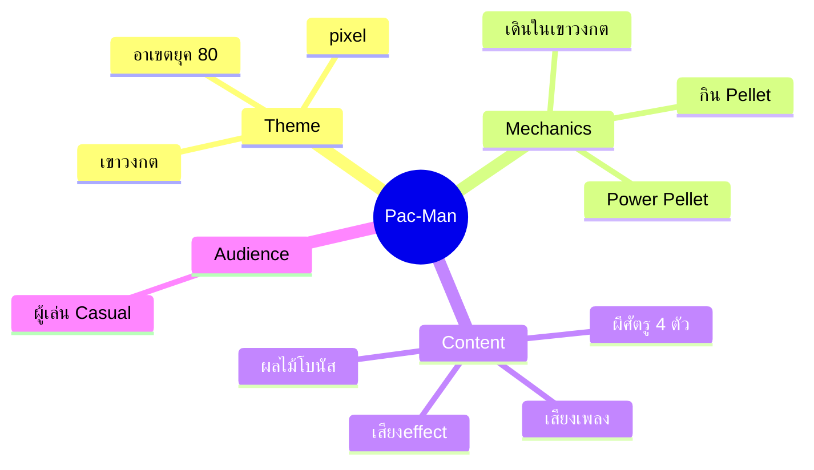
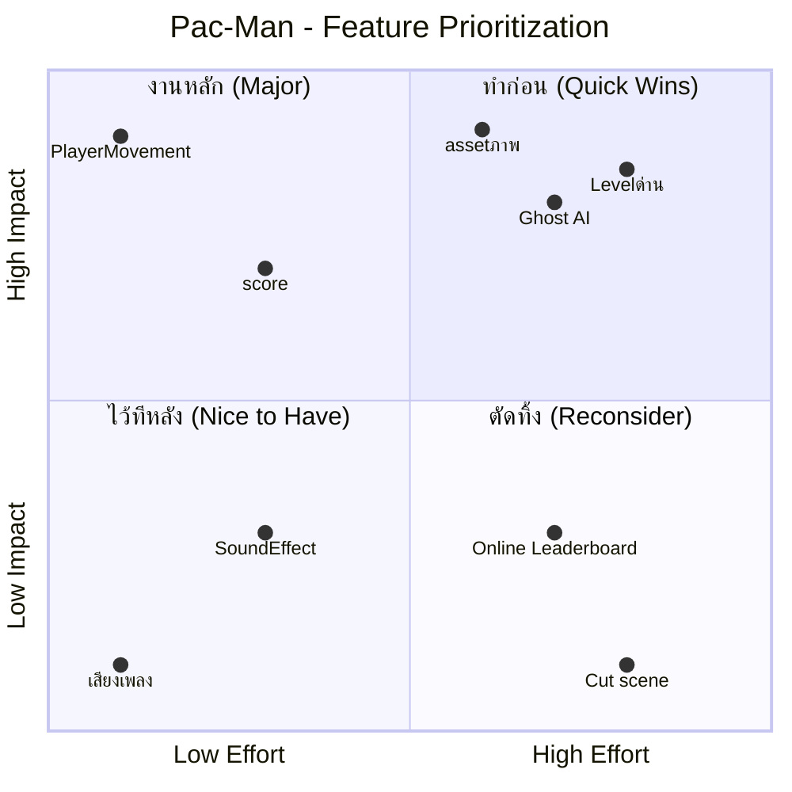
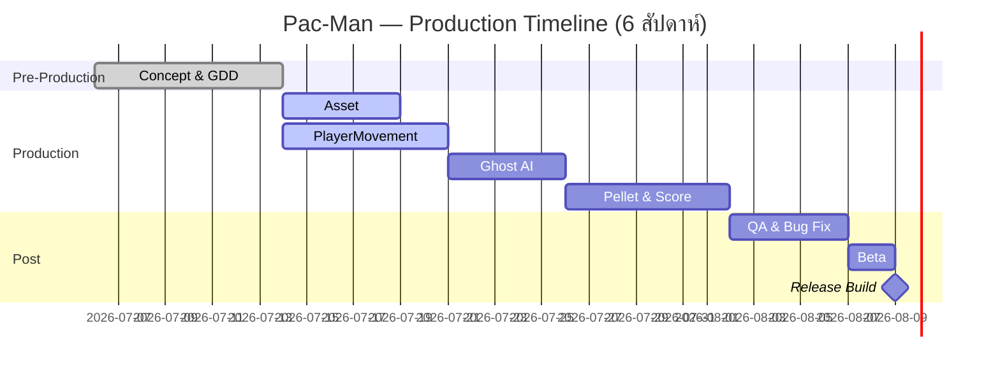

```mermaid
mindmap
  root((Pac-Man))
    Theme
      เขาวงกต
      อาเขตยุค 80
      pixel
    Mechanics
      เดินในเขาวงกต
      กิน Pellet
      Power Pellet
    Content
      ผีศัตรู 4 ตัว
      ผลไม้โบนัส
      เสียงเพลง
      เสียงeffect
    Audience
      ผู้เล่น Casual
```

```mermaid
quadrantChart
  title Pac-Man - Feature Prioritization
  x-axis Low Effort --> High Effort
  y-axis Low Impact --> High Impact
  quadrant-1 "ทำก่อน (Quick Wins)"
  quadrant-2 "งานหลัก (Major)"
  quadrant-3 "ไว้ทีหลัง (Nice to Have)"
  quadrant-4 "ตัดทิ้ง (Reconsider)"
  "PlayerMovement": [0.1, 0.9]
  "score": [0.3, 0.7]
  "Ghost AI": [0.7, 0.8]
  "Online Leaderboard": [0.7, 0.3]
  "Cut scene": [0.8, 0.1]
  "Levelด่าน": [0.8, 0.85]
  "assetภาพ": [0.6, 0.91]
  "เสียงเพลง": [0.1, 0.1]
  "SoundEffect": [0.3, 0.3]
%%PlayerMovementควรได้MVPเพราะจะสามารถทำให้ตัวละครเคลื่อนที่ได้ และ Cutsceneควรตัดทิ้งเพราะไม่จำเป็นต่อเกม

```

```mermaid
gantt
 title Pac-Man — Production Timeline (6 สัปดาห์)
 dateFormat YYYY-MM-DD
 section Pre-Production
 Concept & GDD :done, c1, 2026-07-06, 8d
 section Production
 Asset :active, p1, after c1, 5d
 PlayerMovement :active, p1, after c1, 7d
 Ghost AI : p2, after p1, 5d
 Pellet & Score : p3, after p2, 7d
 section Post
 QA & Bug Fix : q1, after p3, 5d
 Beta : q2, after q1, 2d
 Release Build :milestone, q3, after q2, 0d
```
